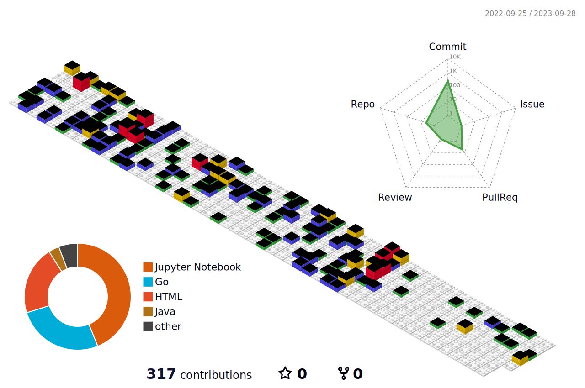

<h1 align="center">Hi  I'm Pumipat Korncharornpisuit.</h1>
<h3 align="center">I'm Student and Developer from Thailand.</h3>

    

<h2> 🙋‍♂️ About Me 🙋‍♂️</h2>

- My name is **Pumipat Korncharornpisuit**
- 🧑‍🎓 I'm study Applied Computer Science at  **[KMUTT](https://www.kmutt.ac.th/)**
- 📚 I’m currently learning Data Science and Machine Learning
- ⚡ Fun fact Play Games , Watching Youtube and Read Books.

  
<h2> 🛠️&nbsp;&nbsp;Languages&nbsp;and&nbsp;Tools</h2>

  <a href="https://skillicons.dev">
    

    
    

  </a>

<h1>Github stats</h1>

  

  
    <a href="https://github.com/o0SoloWolf0o">
    
  

  
  

    </a>
    </a>
    </a>
  

  

  <!--  -->